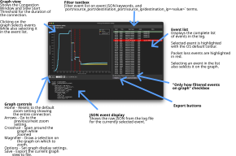

# User manual

Command line guidance for all utilities is accessible using `python3 scripts/<utility>.py --help`. More guidance is available in README.md.

## Visualisation Utility user manual

User interface guide:

* See [/docs/visualiser-diagram.pdf](/docs/visualiser-diagram.pdf) to view the guide as a PDF.

Run `python3 scripts/visualise_utility.py <path to TCPLog file>` to start the utility.

For command-line options run `python3 scripts/visualise_utility.py --help`.