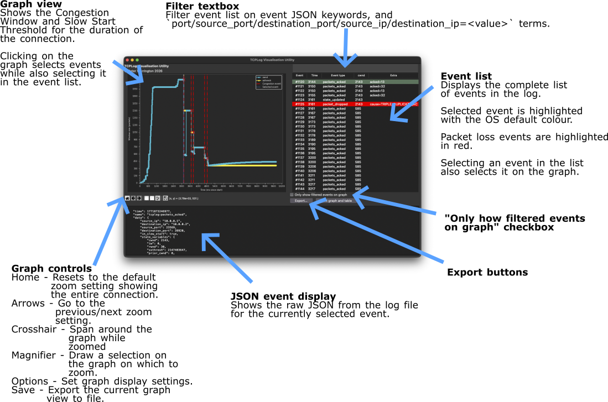

# User manual

Command line guidance for all utilities is accessible using `python3 scripts/<utility>.py --help`. More guidance is available in README.md.

# Visualisation Utility user manual

## Invocation

Run `python3 scripts/visualise_utility.py <path to TCPLog file>` to start the utility.

Run `python3 scripts/visualise_utility.py <path to TCPLog file> --pdf <path to PDF output>` to export a TCPLog file to a pdf graph.

Run `python3 scripts/visualise_utility.py <path to directory of only TCPLog json files> --pdf` to export all files in directory to pdf graphs.

For a list of command-line options run `python3 scripts/visualise_utility.py --help`.

## User interface guide

* See [/docs/visualiser-diagram.pdf](/docs/visualiser-diagram.pdf) to view the guide as a PDF.

### Diagram text:

**Graph view:**
Shows the Congestion Window and Slow Start Threshold for the duration of the connection. Clicking on the graph selects events while also selecting it in the event list.

**Filter textbox:**
Filter event list on event JSON keywords, and port/source_port/destination_port/source_ip/destination_ip=<value> terms.

**Event list:**
Displays the complete list of events in the log.

Selected event is highlighted with the OS default colour.

Packet loss events are highlighted in red.

Selecting an event in the list also selects it on the graph.

**"Only show filtered events on graph" checkbox:**
Filters the graph display based on active search terms.

**Export buttons:**
Buttons to export graph and table data.

**JSON event display:**
Shows the raw JSON from the log file for the currently selected event.

**Graph controls:**

Home - Resets to the default zoom setting showing the entire connection.

Arrows - Go to the previous/next zoom setting.

Crosshair - Span around the graph while zoomed.

Magnifier - Draw a selection on the graph on which to zoom.

Options - Set graph display settings.

Save - Export the current graph view to file.

# Testing guide

Run `make test-all` from the host to collect results for both CUBIC and RENO.

Run `make test CA_ALG=RENO` or `make test CA_ALG=CUBIC` from the host to run these separately.